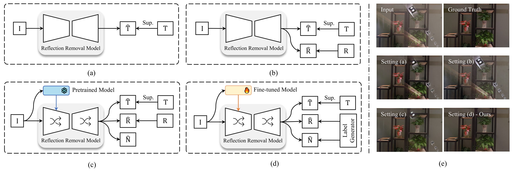

<div align="center">
  
  ## [CVPR26] GFRRN: Explore the Gaps in Single Image Reflection Removal
  
  
  <p align="center">
    <strong>Yu Chen</strong></a><sup>1,2</sup>
    ·
    <strong>Zewei He</strong></a><sup>1,2</sup>
    ·
    <strong>Xingyu Liu</strong></a><sup>1,2</sup>
    ·
    <strong>Zixuan Chen</strong></a><sup>3</sup>
    ·
    <strong>Zheming Lu</strong></a><sup>2</sup>
    <!-- <br> -->
    <br>
    <sup>1</sup>Huanjiang Lab, <sup>2</sup>Zhejiang University, <sup>3</sup>The Chinese University of Hong Kong
</p>
   
<h4>
    <a href="">arXiv</a>
  <span> · </span>
    <a href="https://tabe-i.github.io/GFRRN-project">Project Page</a>
  <span> · </span>
    <a href="">Datasets</a>
  </h4>
</div>



### :memo: ToDo List
- [ ] Release training codes.
- [ ] Release inference codes and pre-trained model. 
- [ ] Release GF Dataset and visual results.
- [ ] Release more visual comparison in our [project page](https://tabe-i.github.io/GFRRN-project/)

### :gear: Quick Start
**Installation**
```shell
# clone this repo
git clone https://github.com/tabe-i/GFRRN.git
cd GFRRN

# create environment
conda create -n GFRRN python=3.10
conda activate GFRRN
pip install -r requirements.txt
```
**Prepare Test Data and Pre-trained Model**
Download [GFRRN.pt](), [GFRRN_s.pt]() and [swin_large_o365_finetune.pth](). Put them in ```weights``` folder. Download datasets ([Google Drive]() or [Baidu Disk]()) and put them in ```datasets``` folder.


**Evaluation**
```shell
# GFRRN
python eval_sirs.py --name gfrrn_eval --arch gfrrn --model gfrrn_model_sirs_lrm --dataset sirs_dataset  --size_rounded --test_nature --weight_path "./weights/GFRRN.pt" --backbone_weight_path "./weights/swin_large_o365_finetune.pth" --base_dir "./datasets"
# GFRRN_s
python eval_sirs.py --name gfrrn_small_eval --arch gfrrn_s --model gfrrn_model_sirs_lrm --dataset sirs_dataset  --size_rounded --test_nature --weight_path "./weights/GFRRN_s.pt" --backbone_weight_path "./weights/swin_large_o365_finetune.pth" --base_dir "./datasets"
```

**Training**
```shell
# GFRRN
python train_sirs.py --name gfrrn_train --arch gfrrn --model gfrrn_model_sirs_lrm --dataset sirs_dataset --loss losses --size_rounded --backbone_weight_path "./weights/swin_large_o365_finetune.pth" --base_dir "./datasets" --batchSize 1
# GFRRN_s
python train_sirs.py --name gfrrn_small_train --arch gfrrn_s --model gfrrn_model_sirs_lrm --dataset sirs_dataset --loss losses --size_rounded --backbone_weight_path "./weights/swin_large_o365_finetune.pth" --base_dir "./datasets" --batchSize 1
```

**Testing**
```shell
# GFRRN
python test_sirs.py --name gfrrn_test --arch gfrrn --model gfrrn_model_sirs_lrm --dataset sirs_dataset  --size_rounded --test_nature --weight_path "./weights/gfrrn.pt" --backbone_weight_path "./weights/swin_large_o365_finetune.pth" --test_dir "[YOUR_TESTING_DATA_DIR]"
# GFRRN_s
python test_sirs.py --name gfrrn_small_test --arch gfrrn_s --model gfrrn_model_sirs_lrm --dataset sirs_dataset  --size_rounded --test_nature --weight_path "./weights/gfrrn_s.pt" --backbone_weight_path "./weights/swin_large_o365_finetune.pth" --test_dir "[YOUR_TESTING_DATA_DIR]"
```

### :star2: Acknowledgements
This project is developped on the codebase of [DSIT](https://github.com/mingcv/DSIT). We appreciate their great work! 

### :love_you_gesture: Citation
If you find our paper and repo are helpful for your research, please consider citing:
```BibTeX
coming soon
```

<!-- Contact -->
### :handshake: Contact
If you have any questions, please contact yuchen2024@zju.edu.cn or zeweihe@zju.edu.cn

